# Evidências do MVP

## 01 — Workspace
Comprova a existência das tabelas produzidas no ambiente Databricks.
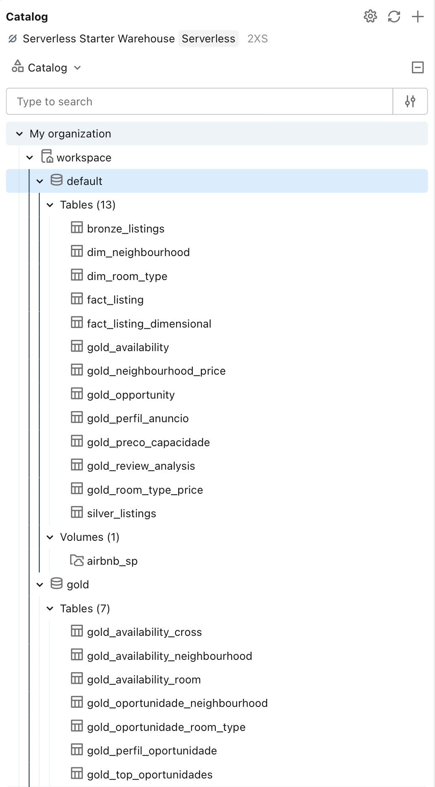

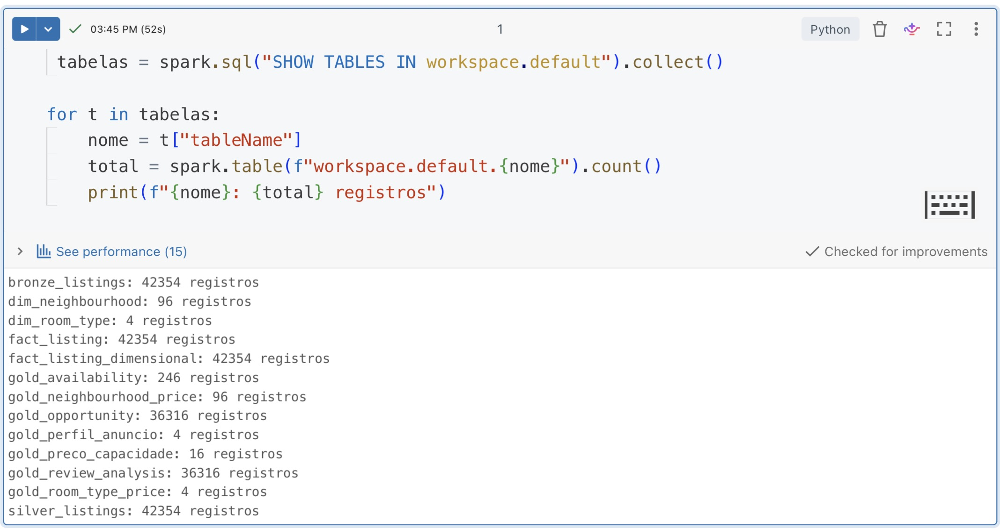

## 02 — Bronze
Comprova a ingestão do arquivo listings.csv.gz e a persistência da camada Bronze.

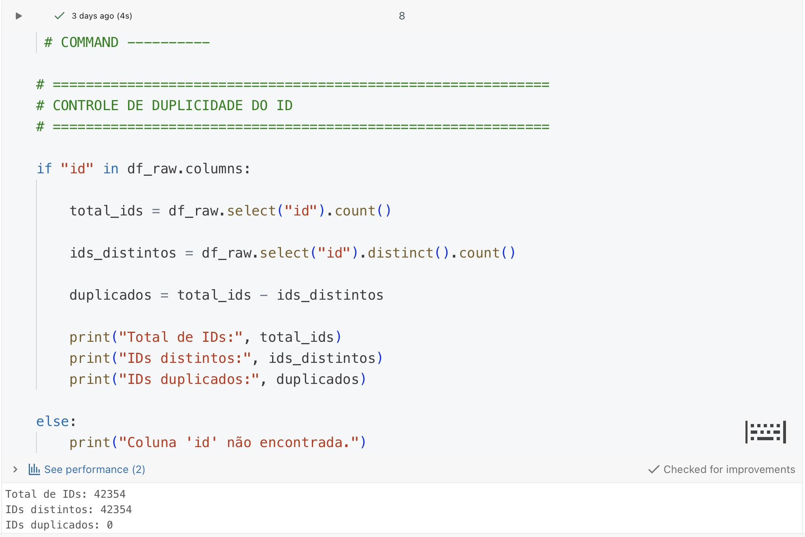

## 03 — Silver
Comprova a transformação, tipagem e tratamento dos dados.

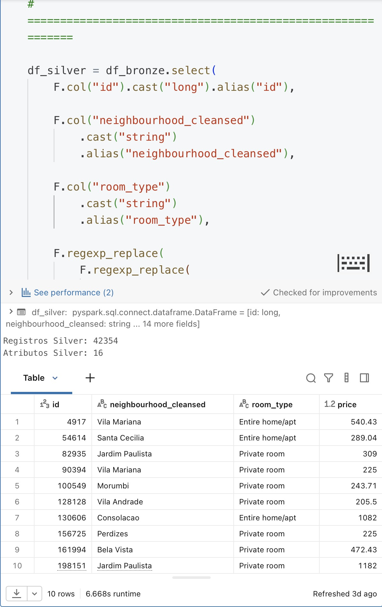

## 04 — Modelagem dimensional
Comprova a criação da tabela fato e das dimensões.

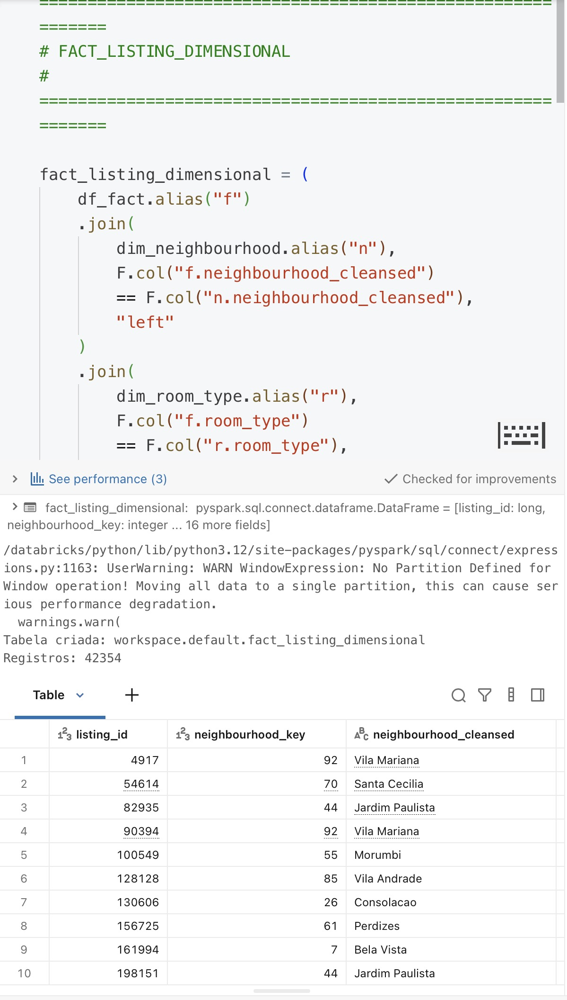

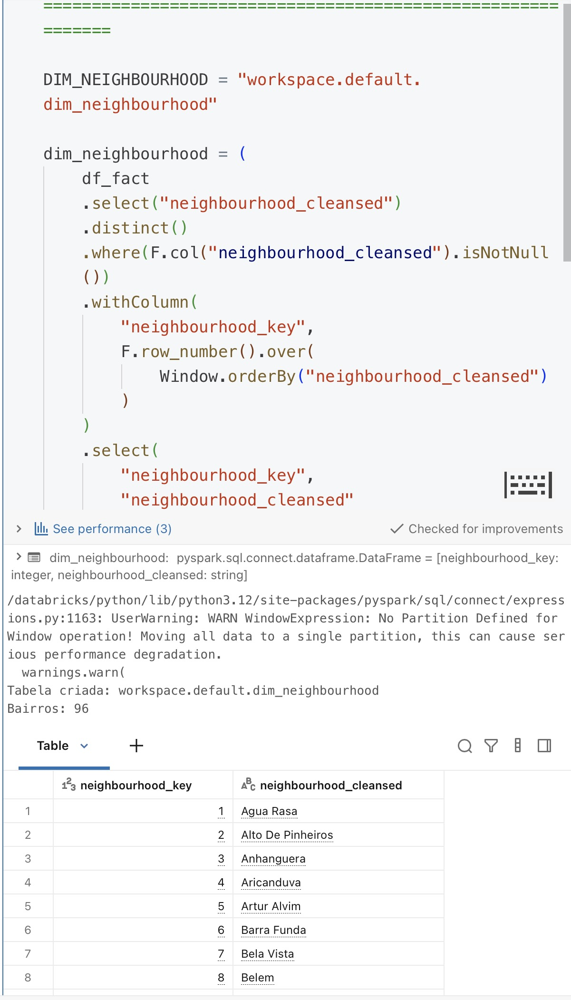

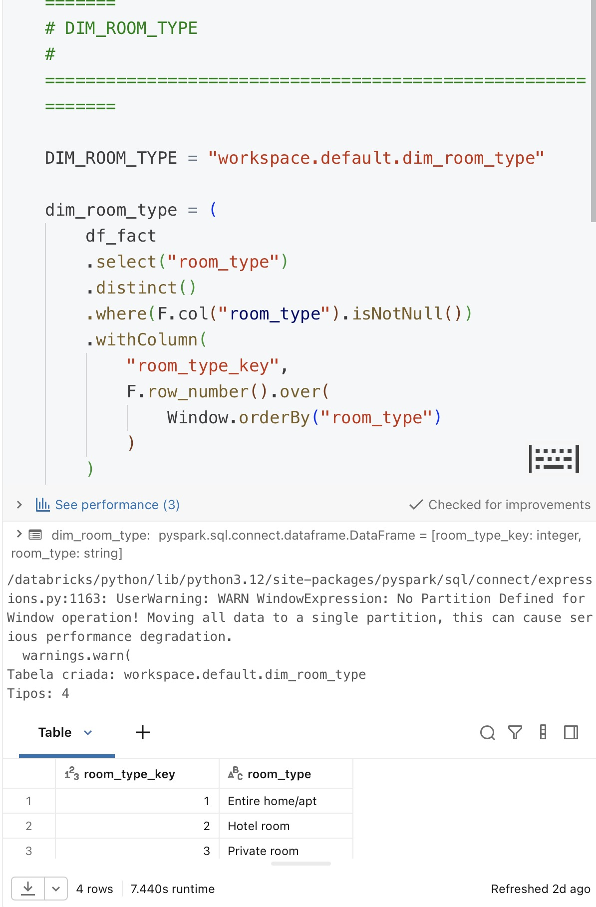

## 05 — Gold
Comprova a criação das tabelas analíticas utilizadas nas respostas às perguntas de negócio.

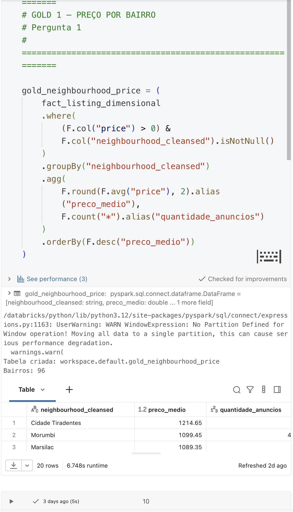

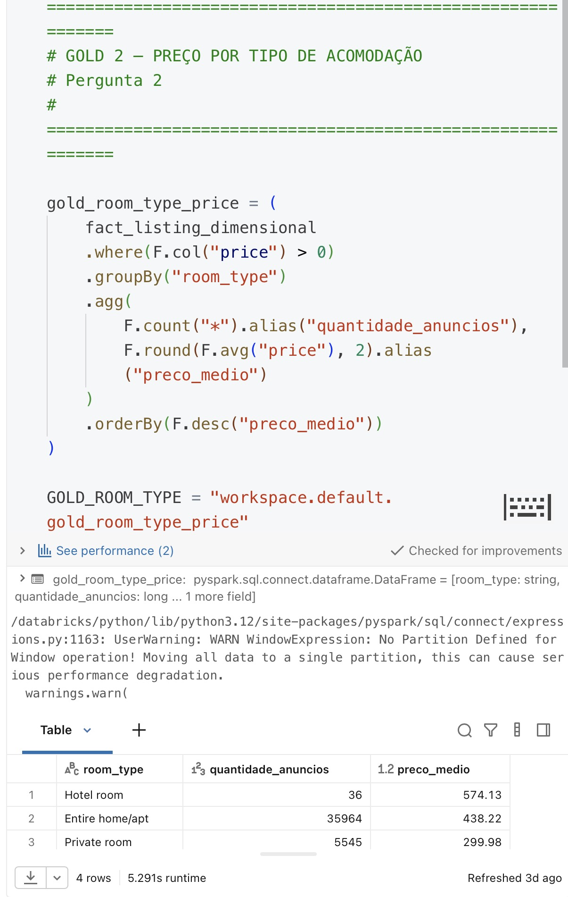

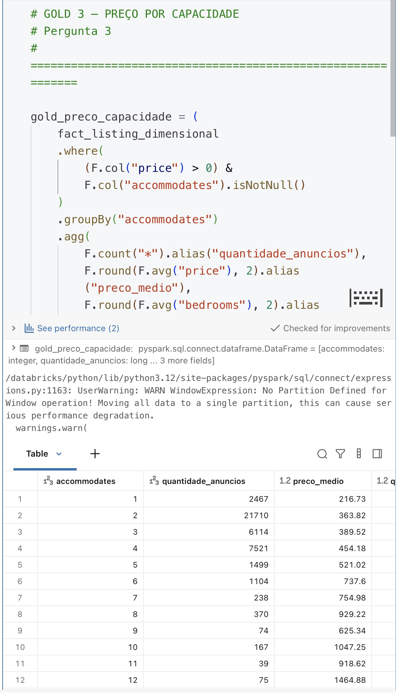

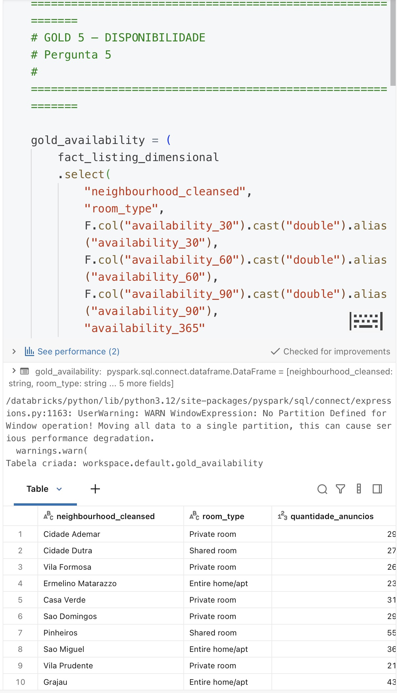

## 06 — Qualidade
Comprova a análise de nulos, duplicidades e outliers.

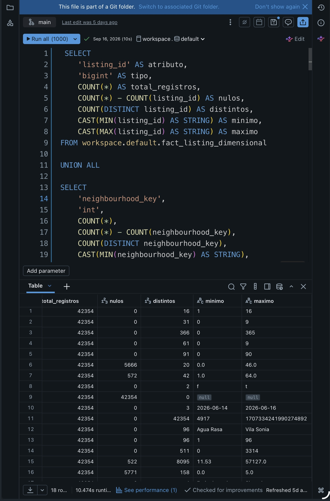

## 07 e 08 — Análises
Comprovam as visualizações utilizadas para interpretar os resultados do projeto.

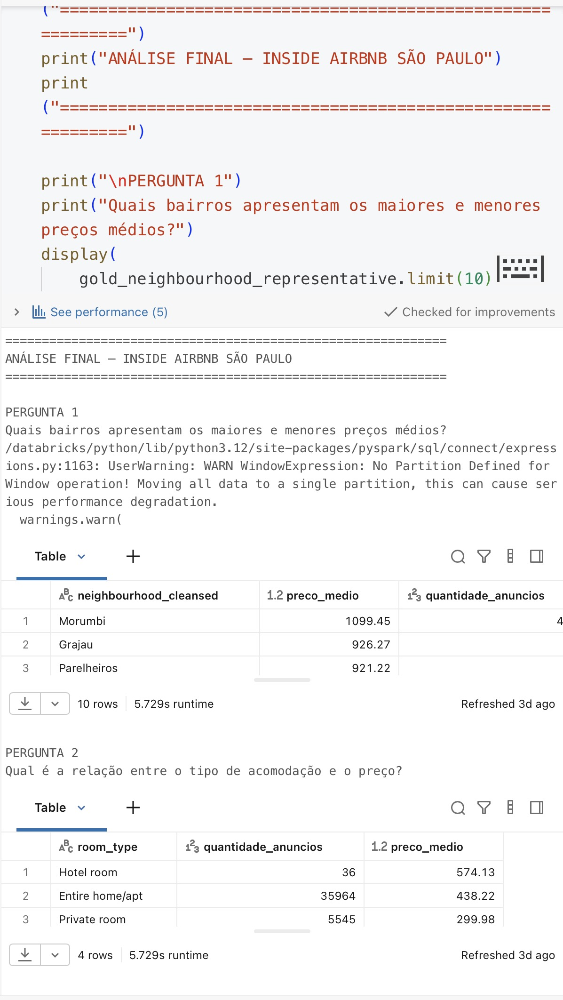

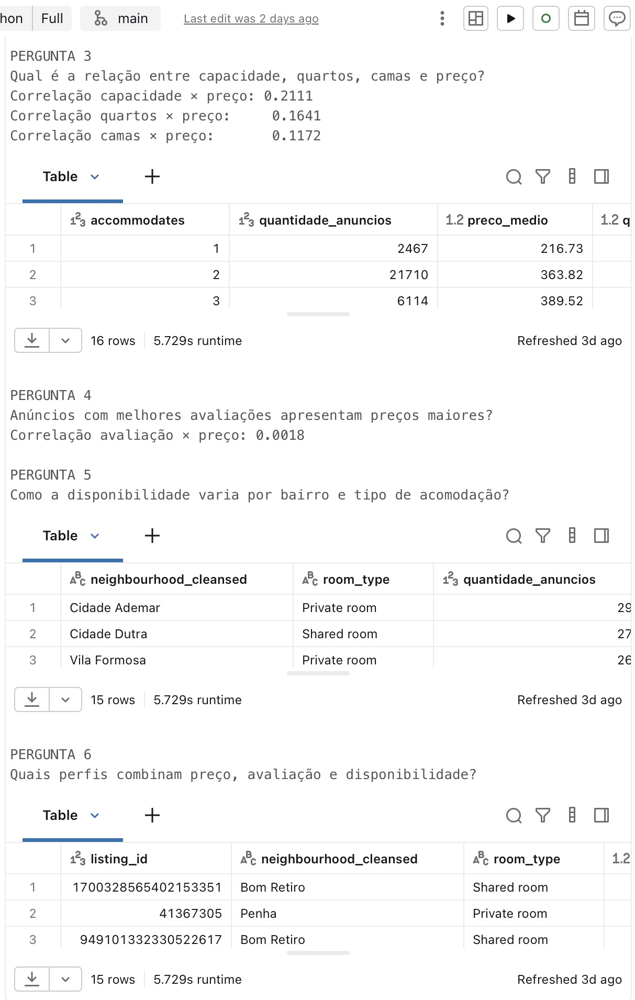

